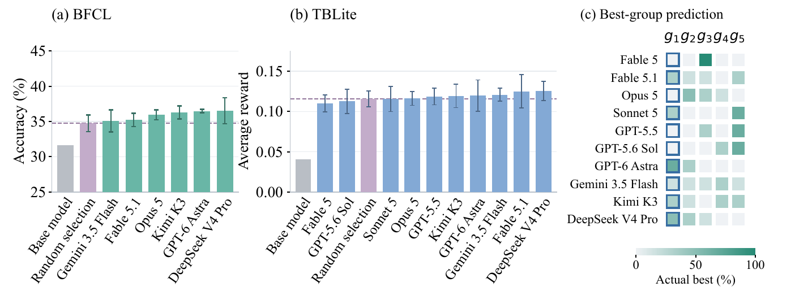
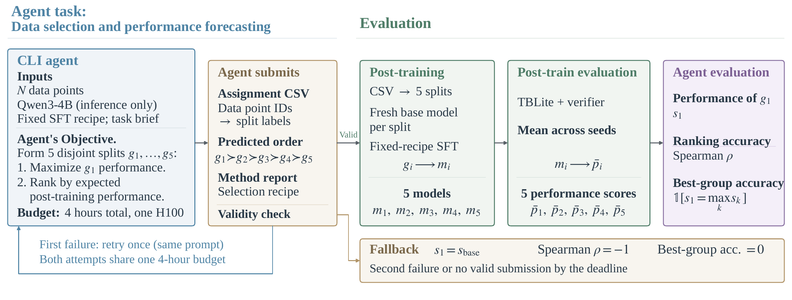

# DataSense-Bench: The First Step Toward an AI Scientist

[📄 Paper](https://arxiv.org/abs/2610.12190) · [🌐 Project Page](https://datasense-bench.github.io/)

DataSense-Bench evaluates AI agents’ ability to **select valuable training data** and **predict its relative value for post-training** across terminal problem solving and tool use. Each agent selects five data groups and ranks their expected performance. We independently fine-tune Qwen3-4B on each group using a fixed recipe within each task.

We measure **selection quality** by the first-ranked group’s post-training performance—TBLite mean reward or BFCL V3 accuracy—and its gain over random selection. We measure **value prediction** using Spearman rank correlation between predicted and observed group rankings, and best-group accuracy: how often the agent’s first-ranked group achieves the highest score among its five groups.



Selection gains over random selection are limited. Agents do not reliably rank their selected groups, and this ability does not hold consistently across tasks.

## How it works



**Select and rank data → Check groups → Train and evaluate → Calculate metrics**

| Task | Training data | Group size | Evaluation |
|---|---|---:|---|
| Terminal problem solving | OpenThoughts-Agent-SFT-10K | 1,000 | TBLite mean reward |
| Multi-turn tool use | EnvScaler | 50 | BFCL V3 accuracy |

Agents can inspect training data and run model forward passes. Training and evaluation take place after selection, with evaluation tasks hidden from the selection agent.

## Quick start

Install the training environment and reproduce metrics from the released scores:

```bash
python3 -m pip install uv
python3 install.py train
source .venv-train/bin/activate

python code/tblite/metric-calculation/calculate.py results/scores.csv --output tblite-metrics.json
python code/bfcl/metric-calculation/calculate.py results/scores.csv --output bfcl-metrics.json
```

For data downloads, selection, training and evaluation, follow the task guide:

- **[TBLite](code/tblite/README.md)** — terminal problem solving, including Daytona setup.
- **[BFCL](code/bfcl/README.md)** — multi-turn tool use.

Each task contains `selection/`, `post-check/`, `post-training/` and `metric-calculation/`. Released assignments, splits, baselines and scores are in `results/`.

## Citation

```bibtex
@misc{zhang2026datasensebench,
  title  = {DataSense-Bench: The First Step Toward an AI Scientist},
  author = {Zhang, Yudi and Cao, Mingyu and Yin, Lu and
            Pechenizkiy, Mykola and Liu, Shiwei},
  year   = {2026}
}
```

## License

Apache License 2.0.
